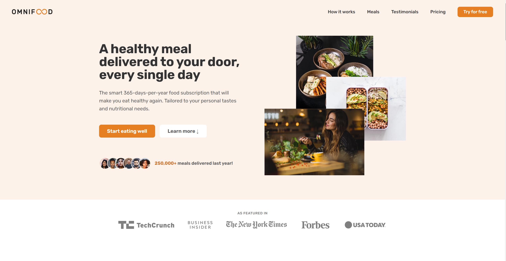

# Omnifood

Omnifood is a fictional online food delivery service that allows users to order various types of food from different restaurants.

## About the Project

This project is part of the "Build Responsive Real-World Websites with HTML and CSS" course created by Jonas Schmedtmann. The goal of this project is to demonstrate the creation of a responsive website using only HTML and CSS. The project includes the following features:

- Modern and attractive design
- Responsive layout that adapts to different screen sizes
- Animations and interactive elements for enhanced user experience
- Clean and organized HTML and CSS structure

## How to Run the Project

1. Download or clone this repository to your computer.
2. Open the `index.html` file in your web browser.

## Live Demo

Check out the live demo of the project on Netlify: [Omnifood Demo](https://omnifood-trpimirtomasic.netlify.app/).

## Author

This project is part of the "Build Responsive Real-World Websites with HTML and CSS" course created by Jonas Schmedtmann.

## License

This project is available under the MIT license. For more information, see the `LICENSE` file.
